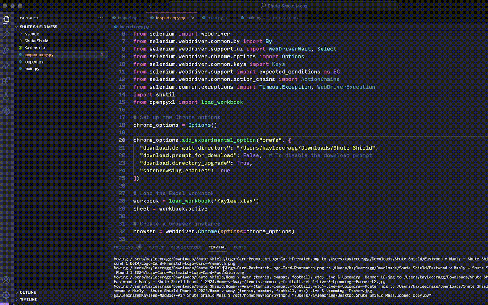
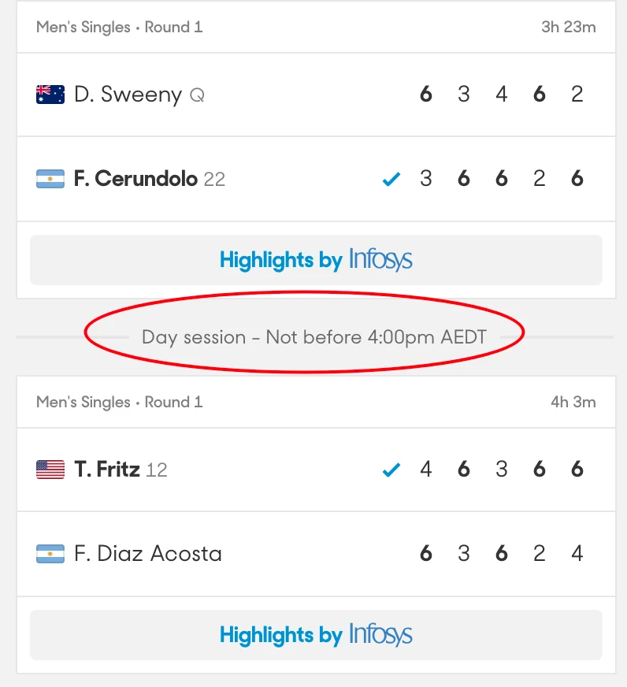
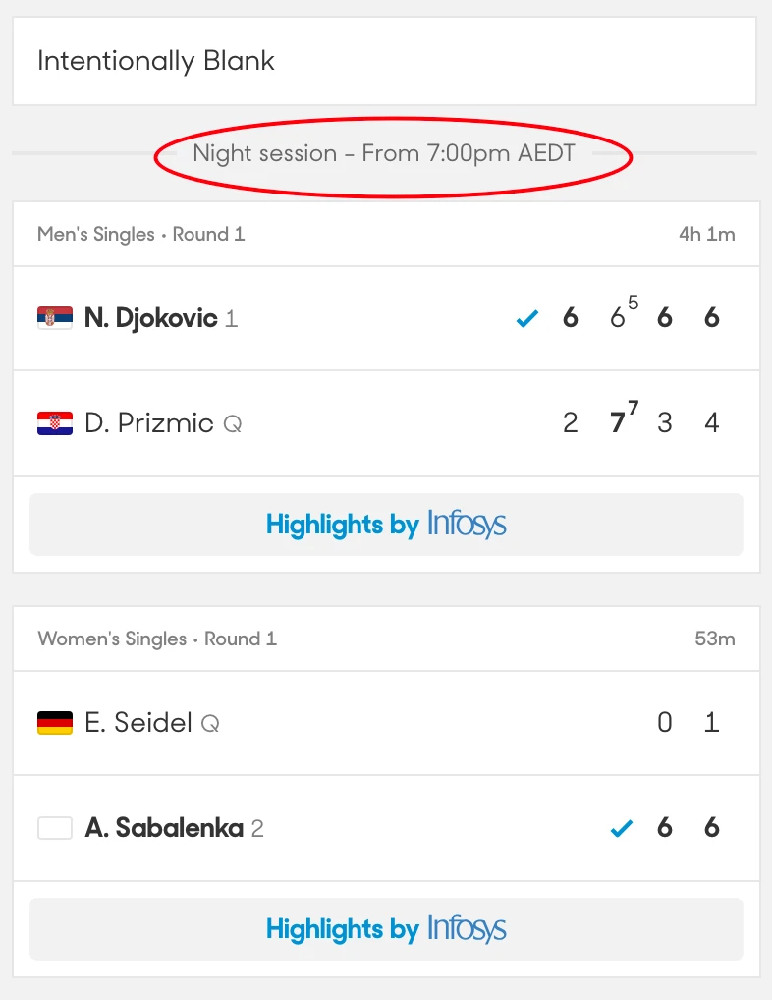
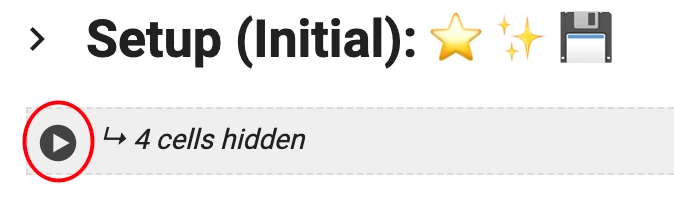
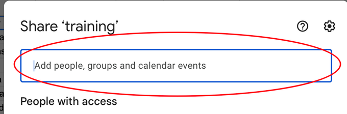
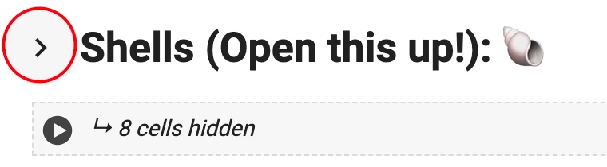
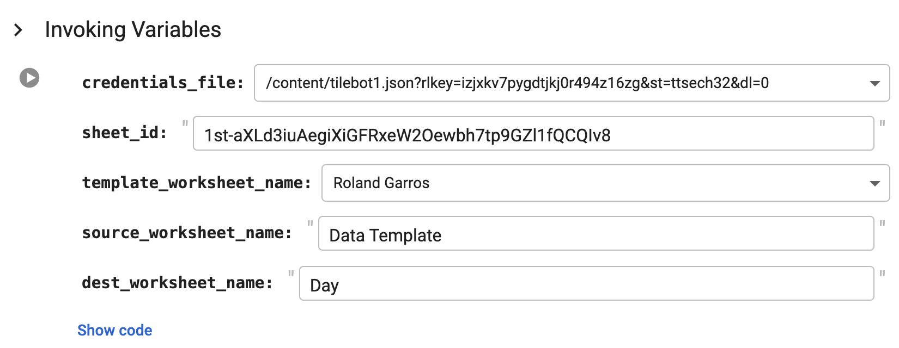
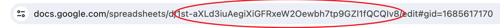

# Kikibot™ guide (tile/shells automation guide)

## Links

- [Kikibot 2.0 (Stan Link)](https://colab.research.google.com/drive/1Tk9nGVMjorHRL5TsOv_erFBpNOSrUpve?authuser=0#scrollTo=RAkRlbr57UXB)
- [Kikibot 2.0 (Public Link)](https://colab.research.google.com/drive/1jFuPN-3OMjf6p990YB8j_fsw3-JhViI0?usp=sharing)
- [Tennis Shells](https://docs.google.com/spreadsheets/d/1st-aXLd3iuAegiXiGFRxeW2Oewbh7tp9GZl1fQCQIv8/edit#gid=1685617170)
- [Shells Checklist (Kris)](https://docs.google.com/spreadsheets/d/1TMpunmgfgJkY1SNFMF17w3t83N5Vc-0vvZLtECGfYxY/edit#gid=0)

## First Step: Data Entry

Open Tennis Shells sheet linked above and open the Data Template tab
 
Input the correct data into the sheet like so:
 

<b>List of Data Needed to be Added to the Sheet:</b>
- Last Name of First and Second Player
- Round
- Start Time
- Gender
- Format
- Court
- Ranking (When Applicable)
- If Commentary is Available or not (Usually on the first few courts only but will be confirmed by programming closer to the day)

When inputting times, you only need to enter the date and times for the <b>first match</b> of the court (as Kikibot will autofill the rest later)
  

<b>Also</b>, input the times for any matches that have ‘not before xyz time', like 'not before 7pm' - if it is a later time than what it would have been.

    
    

## Second Step: Open the Kikibot link and start the setup 🔑

<b>Click the play :arrow_forward: button under the "Setup" section.</b> 

This will download all the necessary stuff for Kikibot to work and will take about a minute to run

<b>If you are using a sheet other than ‘Tennis Shells’ then follow this as well:</b>

<b>If</b> you are starting a new automation (tiles/shells) in a new Google Sheet, you need to add the tile-bot google account to the spreadsheet so that it can interact with the code.

Just go to this icon in the top right corner: 
 

Here’s the google account:
tile-bot@tile-bot-405312.iam.gserviceaccount.com

Add it: 
 

## Third Step: Open the Shells Section

<b>Time to input some information so Kikibot can create the shells with the correct data</b> 

1. <b>credentials_file:</b> 

2. <b>sheet_id:</b> URL of the sheet you are working with (If using ‘Tennis Shells’ this will be already filled out correctly) - Example of the section of the URL needed

  

3. <b>template_worksheet_name:</b> use dropdown to pick the competition
4. <b>source_worksheet_name:</b> name of the tab where you put the Data (Usually leave as ‘Data Template’)
5. <b>dest_worksheet_name:</b> input something like ‘Day 1’, this will be the name of the sheet where the shells are created

<i>For clarity ‘Data Template is the worksheet where you would enter data, ‘Day' is the worksheet where the shells will be generated. You normally would not need to rename Data Template. Rename ‘Day’ as you wish.</i>

<i>NOTE: if there is an already existing sheet with the name that you inputted for the Day sheet, the name will need to be changed in Google Sheets first or you would have to change the Day sheet to be named something else</i>

Once these fields are filled out correctly, Click on the Play Button :arrow_forward: which will confirm the information

