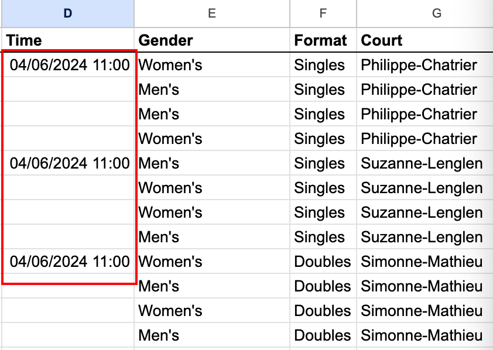

# kikibot™
## Documentation for [Shell bot](https://colab.research.google.com/drive/1jFuPN-3OMjf6p990YB8j_fsw3-JhViI0?usp=sharing)

# Kikibot Guide (Shells Automation Guide)

## Links

- [Kikibot 2.0 (Stan Link)](https://colab.research.google.com/drive/1Tk9nGVMjorHRL5TsOv_erFBpNOSrUpve?authuser=0#scrollTo=RAkRlbr57UXB)
- [Kikibot 2.0 (Public Link)](https://colab.research.google.com/drive/1jFuPN-3OMjf6p990YB8j_fsw3-JhViI0?usp=sharing)
- [Shells Checklist (Kris)](https://docs.google.com/spreadsheets/d/1TMpunmgfgJkY1SNFMF17w3t83N5Vc-0vvZLtECGfYxY/edit#gid=0)
- [Tennis Shells](https://docs.google.com/spreadsheets/d/1st-aXLd3iuAegiXiGFRxeW2Oewbh7tp9GZl1fQCQIv8/edit#gid=1685617170)

## First Step: Data Entry

1. Input the correct data into the sheet like so:

   - Enter only the date and times for the first match on the court.
   - Input times for any matches labeled "not before xyz time" (e.g., "not before 7 pm") if that time is later than the default time.

## Second Step: Click the Play Button

1. Click the play button under the "Setup" section.
2. **Note**: If using a sheet other than "Tennis Shells," ensure it is properly set up.

## Third Step: Open the Shells Section

1. Open the "Shells" section by pressing the small arrow (indicated by a red circle).

## Adding Tile-Bot Account

1. If starting a new automation in a new Google Sheet, add the tile-bot Google account to the spreadsheet so it can interact with the code:
   - Google account: `tile-bot@tile-bot-405312.iam.gserviceaccount.com`

2. To add the account, click the sharing icon in the top right corner and input this email address.

## Notes

- **Data Template:** This is the worksheet where data should be entered.
- **Day Sheet:** This is where the shells will be generated.
  - Normally, no need to rename the Data Template.
  - Rename the "Day" sheet as desired, but ensure no existing sheet already uses that name.
  - If necessary, change the sheet name in Google Sheets or rename the Day sheet.

